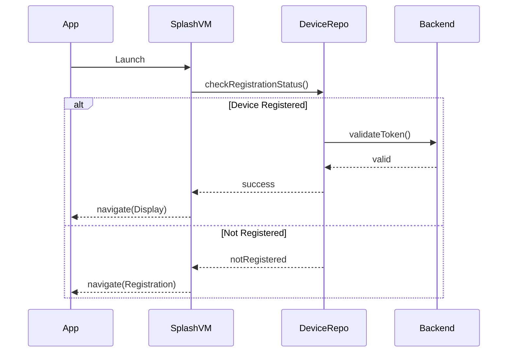
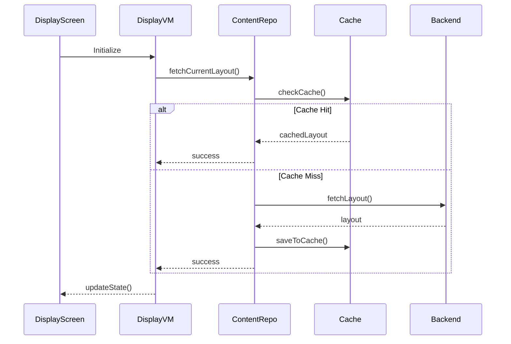

# 🔁 04. Core Application Flow & User Journey

## 🤖 AI Agent Task Checklist

### Registration Flow
- [ ] **Splash Screen**
  - [ ] Implement branded splash screen
  - [ ] Check device registration status
  - [ ] Handle navigation logic

- [ ] **Device Registration**
  - [ ] Generate/retrieve hardware ID
  - [ ] Implement QR code generation
  - [ ] Set up registration polling
  - [ ] Handle registration success/failure

- [ ] **Content Display**
  - [ ] Set up content fetching
  - [ ] Implement caching system
  - [ ] Create content renderers
  - [ ] Handle transitions

- [ ] **Background Operations**
  - [ ] Implement boot receiver
  - [ ] Set up heartbeat service
  - [ ] Configure FCM
  - [ ] Handle offline mode

## Implementation Guide

### 1. Application Launch Flow



#### Implementation Steps:

1. **Splash Screen Setup**
```kotlin
@Composable
fun SplashScreen(
    viewModel: SplashViewModel = hiltViewModel(),
    onNavigateToDisplay: () -> Unit,
    onNavigateToRegistration: () -> Unit
) {
    val uiState by viewModel.uiState.collectAsState()
    
    LaunchedEffect(Unit) {
        viewModel.checkInitialState()
    }
    
    LaunchedEffect(uiState.destination) {
        when (uiState.destination) {
            SplashDestination.Display -> onNavigateToDisplay()
            SplashDestination.Registration -> onNavigateToRegistration()
            else -> Unit
        }
    }
    
    // UI implementation
}
```

2. **Registration Flow**
```kotlin
@Composable
fun RegistrationScreen(
    viewModel: RegistrationViewModel = hiltViewModel(),
    onRegistrationComplete: () -> Unit
) {
    val uiState by viewModel.uiState.collectAsState()
    
    LaunchedEffect(uiState.isRegistered) {
        if (uiState.isRegistered) {
            onRegistrationComplete()
        }
    }
    
    Column(
        modifier = Modifier.fillMaxSize(),
        horizontalAlignment = Alignment.CenterHorizontally
    ) {
        // QR Code display
        QRCodeDisplay(
            code = uiState.registrationCode,
            isLoading = uiState.isLoading
        )
        
        // Status messages
        StatusMessages(
            status = uiState.status,
            error = uiState.error
        )
    }
}
```

### 2. Content Display Flow



#### Implementation Steps:

1. **Content Display Setup**
```kotlin
@Composable
fun DisplayScreen(
    viewModel: DisplayViewModel = hiltViewModel()
) {
    val uiState by viewModel.uiState.collectAsState()
    
    // Handle network connectivity
    val connectivityObserver = remember { NetworkConnectivityObserver(LocalContext.current) }
    val isOnline by connectivityObserver.observe().collectAsState(initial = true)
    
    LaunchedEffect(isOnline) {
        viewModel.onNetworkStatusChanged(isOnline)
    }
    
    Box(modifier = Modifier.fillMaxSize()) {
        when {
            uiState.isLoading -> LoadingIndicator()
            uiState.error != null -> ErrorDisplay(uiState.error)
            uiState.currentContent != null -> {
                ContentRenderer(
                    content = uiState.currentContent,
                    onPlaybackComplete = viewModel::onPlaybackComplete,
                    onError = viewModel::onPlaybackError
                )
            }
        }
        
        // Offline indicator if needed
        if (!isOnline) {
            OfflineIndicator()
        }
    }
}
```

### 3. Background Operations

1. **Boot Receiver**
```kotlin
class BootReceiver : BroadcastReceiver() {
    override fun onReceive(context: Context, intent: Intent?) {
        if (intent?.action == Intent.ACTION_BOOT_COMPLETED) {
            // Start app
            context.startActivity(
                Intent(context, MainActivity::class.java)
                    .addFlags(Intent.FLAG_ACTIVITY_NEW_TASK)
            )
        }
    }
}
```

2. **Heartbeat Service**
```kotlin
@HiltWorker
class HeartbeatWorker @AssistedInject constructor(
    @Assisted context: Context,
    @Assisted params: WorkerParameters,
    private val repository: DeviceRepository
) : CoroutineWorker(context, params) {

    override suspend fun doWork(): Result {
        return try {
            repository.sendHeartbeat()
            Result.success()
        } catch (e: Exception) {
            Result.retry()
        }
    }
}
```

## Verification Steps

1. **Registration Flow**
```bash
# Test QR code generation
./gradlew test --tests "*.RegistrationViewModelTest"

# Verify registration UI
./gradlew connectedAndroidTest --tests "*.RegistrationScreenTest"
```

2. **Content Display**
```bash
# Test content loading
./gradlew test --tests "*.DisplayViewModelTest"

# Verify media playback
./gradlew connectedAndroidTest --tests "*.ContentRendererTest"
```

3. **Background Tasks**
```bash
# Test boot receiver
./gradlew test --tests "*.BootReceiverTest"

# Verify heartbeat service
./gradlew test --tests "*.HeartbeatWorkerTest"
```

## Success Criteria

- [ ] App launches and checks registration status within 2 seconds
- [ ] QR code generation and display works reliably
- [ ] Registration polling succeeds within timeout period
- [ ] Content displays with smooth transitions
- [ ] App recovers from network interruptions
- [ ] Background tasks execute reliably
- [ ] Memory usage remains stable during extended operation

## Common Issues & Solutions

1. **Registration Failures**
   - Verify network connectivity
   - Check backend API status
   - Validate QR code format
   - Monitor registration timeout

2. **Content Display Issues**
   - Check media cache status
   - Verify content format support
   - Monitor memory usage
   - Log playback errors

3. **Background Task Problems**
   - Check WorkManager constraints
   - Verify boot receiver registration
   - Monitor battery optimization settings
   - Log task execution status

## References

- [Android App Startup Guide](https://developer.android.com/topic/libraries/app-startup)
- [WorkManager Best Practices](https://developer.android.com/topic/libraries/architecture/workmanager/basics)
- [Compose for TV Documentation](https://developer.android.com/tv/compose)